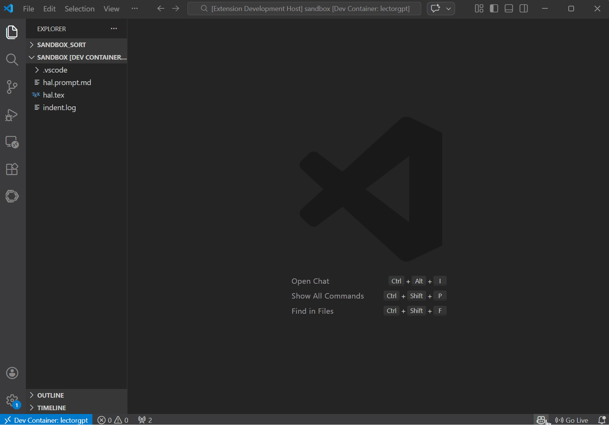

# LectorGPT ✍️

**LectorGPT** is a professional-grade writing assistant for Visual Studio Code.
It empowers authors and creative writers to refine their prose using world-class
AI models from **OpenAI** and **Google Gemini**.

---

## 👀 Demo

_Refining creative prose directly within the editor using the
`Refine Active Selection` command._

---

## ✨ Features

- **Dual-Vendor Integration**: Seamlessly switch between OpenAI and Google
  Gemini.
- **Contextual Refinement**: Enhance your active text selections with a
  single command.
- **Granular Model Control**: Select specific models
  (e.g., GPT-4o, Gemini 1.5 Pro) to balance speed and creativity.
- **Customizable Personas**: Choose your system prompt source to define
  the "voice" of your digital editor.
- **Secure Configuration**: Manage your API keys safely through the native
  VS Code command palette.

---

## 🚀 Getting Started

1. **Install the Extension**: Find LectorGPT in the VS Code Marketplace.
2. **Register your API Key**:
   Open the Command Palette (`Ctrl+Shift+P` / `Cmd+Shift+P`) and run:
   `LectorGPT: Register New API Key`
3. **Configure your Setup**:
    - Run `LectorGPT: Select Active Vendor Setup` to pick your provider.
    - Run `LectorGPT: Select Active Model` to choose your AI engine.
4. **Refine your Prose**:
   Highlight any text in your editor and execute:
   `LectorGPT: Refine Active Selection`

---

## 🛠 Commands

| Command Title                   | Command ID                                     |
| :------------------------------ | :--------------------------------------------- |
| **Refine Active Selection**     | `lectorgpt.refine-active-selection`            |
| **Select Active Vendor Setup**  | `lectorgpt.select-active-vendors`              |
| **Select Active Model**         | `lectorgpt.select-active-model`                |
| **Register New API Key**        | `lectorgpt.register-new-api-key`               |
| **Unregister API Key**          | `lectorgpt.unregister-api-key`                 |
| **Select System Prompt Source** | `lectorgpt.select-active-system-prompt-source` |

---

## ⚙️ Requirements

- An active API key from [OpenAI](https://platform.openai.com/) and or
  [Google AI Studio](https://aistudio.google.com/).
- VS Code version `1.108.1` or higher.

---

## 📝 License

This project is licensed under the **MIT License**.

## 🔗 Links

- **Repository**: [GitHub](https://github.com/Silverdust-ZH/LectorGPT.git)
- **Publisher**: [Samuel Lörtscher](https://github.com/Silverdust-ZH)

---

_Developed with ❤️ for creative writers._
